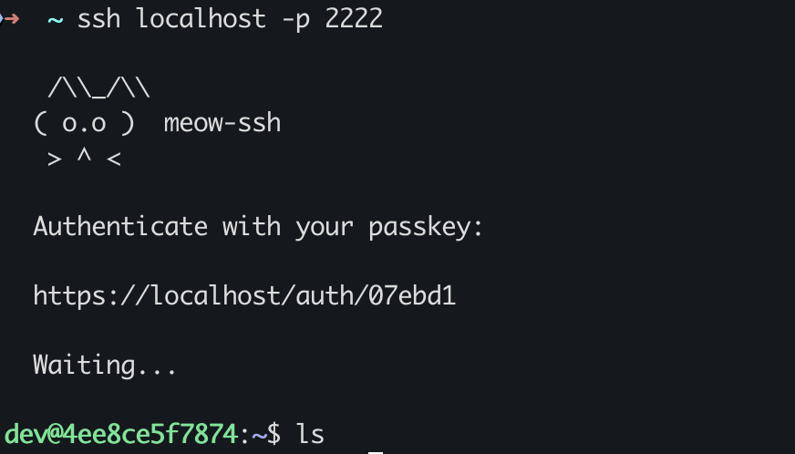
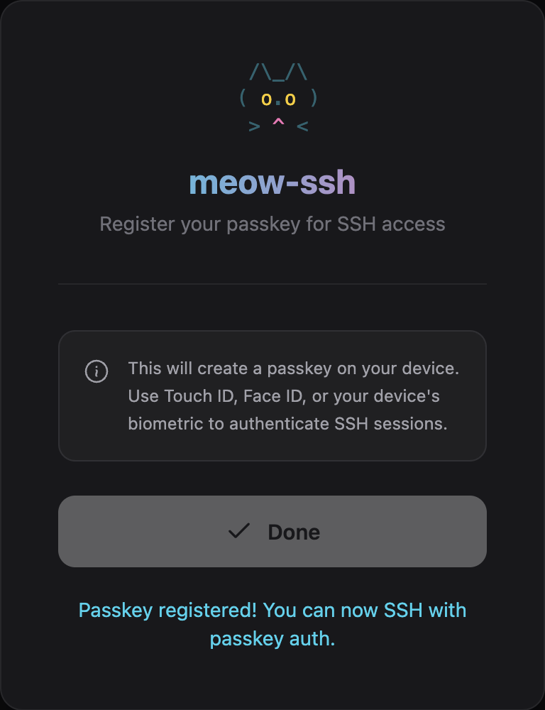
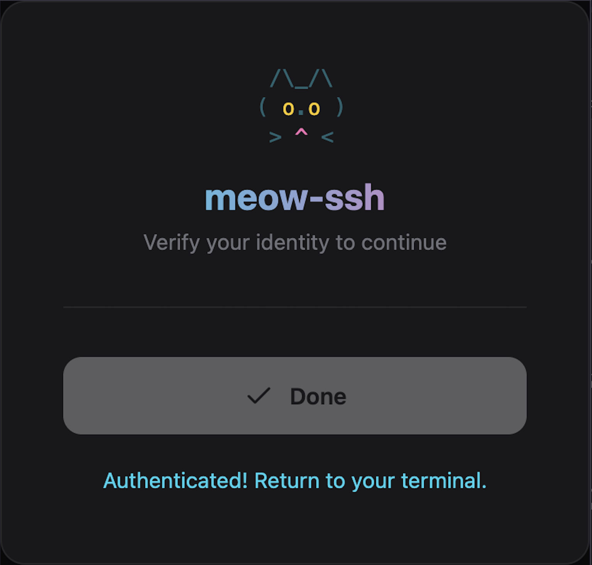
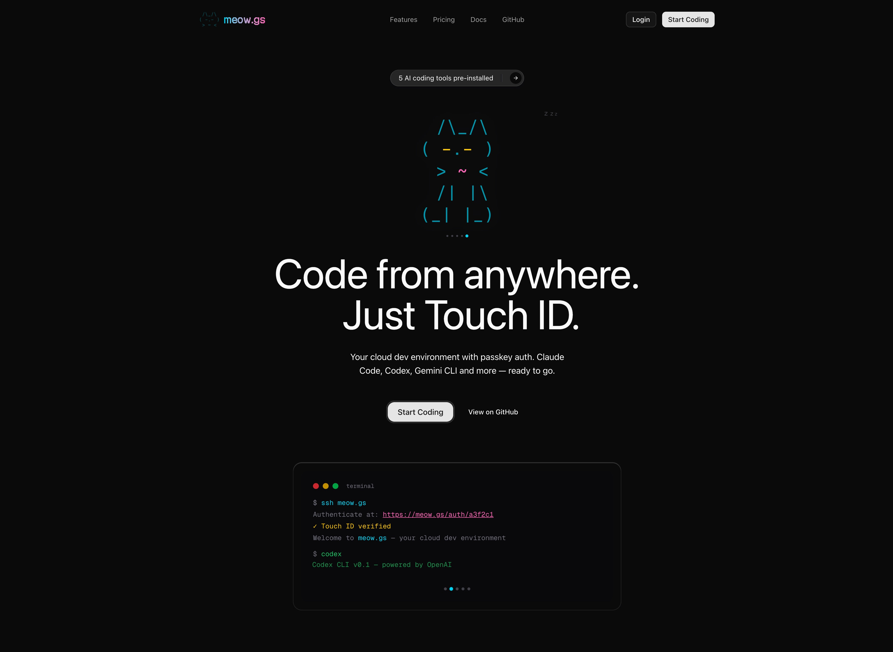

# meow-ssh

```
   /\_/\
  ( o.o )  meow-ssh
   > ^ <
```

SSH authentication via browser passkeys (Touch ID / Face ID).
No passwords. No SSH keys. Just biometrics.

## Screenshots

<p align="center">
  
</p>
<p align="center">
  
</p>
<p align="center">
  
</p>

## How it works

1. SSH connects to the meow-ssh server
2. Server shows a short auth URL
3. Open it in your browser — Touch ID / Face ID
4. SSH session unlocks

Also includes a browser terminal at `/terminal` with xterm.js.

## Quick start

### Docker

```bash
docker build -t meow-ssh .
docker run -p 2222:2222 -p 3000:3000 -v meow-data:/data meow-ssh
```

Register your first passkey at `http://localhost:3000/register?secret=test`, then:

```bash
ssh localhost -p 2222
```

### From source

```bash
cargo build --release

./target/release/meow-ssh \
  --domain your-domain.com \
  --ssh-port 2222 \
  --web-port 3000 \
  --shell-user youruser
```

## CLI options

```
--domain <domain>       Your domain (required)
--ssh-port <port>       SSH port (default: 22)
--web-port <port>       HTTP/WebSocket port (default: 3000)
--host-key <path>       SSH host key path (auto-generated if missing)
--db <path>             SQLite database path (default: ./meow.db)
--shell <path>          Shell to spawn (default: /bin/bash)
--shell-user <user>     Run shell as this user (via sudo)
--shell-home <path>     Set HOME for shell sessions
--registration-secret   Secret for passkey registration (default: test)
--no-registration       Disable new passkey registration
```

## Architecture

Single Rust binary. No Node.js, no npm.

| Component | Library |
|---|---|
| SSH server | russh 0.57 (post-quantum KEX) |
| HTTP + WebSocket | axum 0.8 |
| WebAuthn passkeys | webauthn-rs 0.5 |
| Database | rusqlite (SQLite) |
| PTY | pty-process 0.5 |
| Static assets | rust-embed |

## Security

- Passkeys are domain-bound (WebAuthn rpID) — can't be phished
- Auth tokens: 6 hex chars, single-use, 5-minute expiry
- Registration requires server-side secret validation
- Server-side WebAuthn verification (not client-only)
- Post-quantum key exchange (mlkem768x25519-sha256 via russh 0.57)
- All state in local SQLite with automatic cleanup

## Hosted version

Don't want to self-host? [meow.gs](https://meow.gs) gives you a cloud dev environment with passkey auth — Claude Code, Codex, Gemini CLI and more, ready to go.

<p align="center">
  <a href="https://meow.gs">
    
  </a>
</p>

## License

BSL 1.1 — see [LICENSE](LICENSE). Converts to Apache 2.0 after 4 years.
